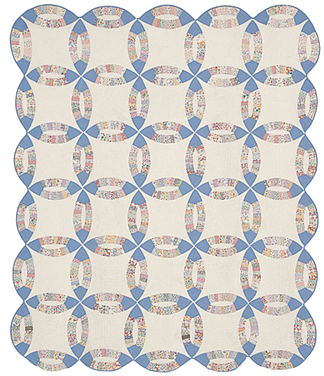

  

    

      <h1 style="font-size:calc(20px + 3vw);"> Aim 1: Improve Interoperability and Reproducibility </h1>
      
Building Interconnected and Open Data Resources

    

  <!--  

      <figure style="margin-left:0px;margin-right:0px;max-width:300px;" id="quilter">
        
        <figcaption id="cap">Making systems interoperable is a kind of quilting. Image originally from Rocky Mountain Quilt Museum. Thomer and Rayburn, 2023: “A Patchwork of Data Systems”: Quilting as an Analytic Lens and Stabilizing Practice for Knowledge Infrastructures. <i>Science, Technology, & Human Values.</i></figcaption>
      </figure>
    
 -->
  

  

    

    <h2>Overview</h2>
    

      
We will develop a network of data managers, research practitioners, disciplinary experts, and early career researchers focused on identifying gaps and mismatches among Quaternary data resources, in order to improve interoperability among them. We will particularly prioritize: <ul>
      <li>outreach to data managers and assessment of the current Quaternary informatics landscape,</li>
      <li>identifying areas for crosswalk development to resolve conflicts between existing ontologies and to help support the adoption of CARE aims,</li>
        <li>identifying points of connection between repositories, where the addition of related identifiers could help bridge silos, and</li> 
        <li>building on existing initiatives to make data resources more open and interconnected.</li></ul>

      <h2>Activities</h2> 
        <button class="bttn" id="info-landscape" onclick="Func_infolandscape()">
            

An <strong>informatics landscape analysis</strong>

</button>
        

          

          
The aim of this analysis is to map the current Quaternary informatics landscape, evaluate current interoperability efforts, and recommend best practices going forward. Webinar discussions and symposia hackathons will be used to  better understand how data managers are using metadata standards and curating data. We will additionally conduct a structured evaluation of three widely used data resources spanning different data domains: Global Biodiversity Information Facility (GBIF),  the Open Context archaeological repository, and Neotoma Paleoecology Database. 

            
We will evaluate 
              <ol>
              <li>the semantic  <i>coverage</i> of each repository (e.g. what data elements are captured by each repository, and what are the  specific meanings of those elements?) </li>
              <li>points of <i>convergence and conflict</i> between repositories (e.g. what data elements overlap and which are fundamentally mismatched?)</li>
              <li>the <i>completeness</i> of records within repositories, and</li>
              <li>points for further curatorial intervention—places where additional data curation could make records more accessible or interoperable.</li></ol>

          

        

     
        <button class="bttn" id="symp-hack" onclick="Func_symphack()">
          

The Year 1 <strong>webinar series</strong> and a <strong>symposium hackathon</strong>

      </button>
        

          

            
The primary audience for the webinar series and symposium hackathon is data managers, with close interaction with disciplinary practitioners and other members of the broader community. A series of four webinars will be held prior to the symposium hackathon, to ensure that data managers have a common understanding of key concepts and toolsets applicable to the process of developing interoperable systems. These webinars will include opportunities for structured discussion to support the Mapping the Landscape project, as well as help build relationships between participants prior to the symposium hackathon.

              
Webinar topics will include 
                <ol>
<li>an overview of common data standards (e.g. DublinCore, Science on Schema, Geoscience Standard Names)</li> 
<li>how individuals can serialize their data formats to JSON-LD or other metadata schemes, and</li> 
<li>how to improve findability and interoperability through services such as DataCite, GeoCODEs  or other tools.</li></ol>

            
The hackathon aims to accelerate development of the community of practice established  through the webinars—to learn about ourselves, the work we have done in the past and wish to do in the  future, and start a full assessment of existing open data science resources and opportunities for improved  integration. Development of the hackathon will draw from discussions in webinars and be focused on  implementing solutions, specifically using the identified case studies from across the project to anchor discussions.

          

       

   
          <button class="bttn" id="case-study" onclick="Func_casestudy()"> 
            

The <strong>“Creating Interoperable Data” case study</strong>

      </button>
          

            

              
Many legacy Quaternary datasets are found in specimen-curation repositories, like museums, with database structures designed to capture specimen-specific long-tail data and often curated decades past without regard to FAIR or CARE principles. This case study will focus on expanding FAIR data curation protocols from the ZooArchNet (ZAN) project to 
                <ol>
<li>link legacy museum-curated zooarcheological data across various community-curated data repositories, and</li>
                  <li>align with CARE guidelines and descendant  community priorities.</li></ol>

ZAN has already created pathways to standardize, crosswalk and link zooarchaeological datasets across archaeological and biological repositories. In this case study, UF personnel will work with RCN informatics domain experts and repository data managers, in consultation with Indigenous stakeholders, to expand the ZAN protocols. Continued work on data standards alignments, Linked Open Data, and other intersectional methods will  be used to mobilize Darwin Core-enabled legacy zooarchaeological data from the Florida Museum curation database across multiple repositories.

Our work will be grounded in consultation with descendant community members and tribal authorities to ensure that their interests are represented in our decisions of how to integrate CARE principles within open data sharing. Our tribal collaborators will form an integral part of our use case activities, ensuring that any data sharing is culturally appropriate, ethical, and in support of tribal priorities involving the documentation and protection of environmental resources and cultural heritage. This effort will represent a proof-of-concept workflow and produce best-practice guidelines for such interdisciplinary, inter-repository FAIR and CARE open sharing of legacy curated data that will be disseminated via workshops for the archaeological and zooarchaeological communities.  

            

      

     
      <button class="bttn" id="guidelines" onclick="Func_guidelines()"> 
          

<strong>Guidelines for data alignment</strong> between repositories and domains

      </button>
      

          

            
Data managers will draw on findings from the Mapping the Landscape effort, webinars, hackathon, and the case study to develop specific guidelines for alignment between Quaternary data resources. Unlike many crosswalks, we will focus on aligning repositories rather than individual datasets, and will center the specific integration needs of the Quaternary community. Likely outcomes will include 
              <ul>
                <li>best practices for setting up repository APIs or other access points, </li> 
                <li>crosswalks between repository schemas,</li>
                <li>guidance for the implementation and use of external APIs to help manage links to external data, and</li>
                <li>the use of Science on Schema or other external ontologies for reporting data.</li></ul>  

          

      

      

    

    <!-- 

        <figure style="margin-right:0px;min-width:220px;" id="fair-des">
        
        <figcaption style="text-align:center;"></figcaption>
        </figure>
    
 -->
  

