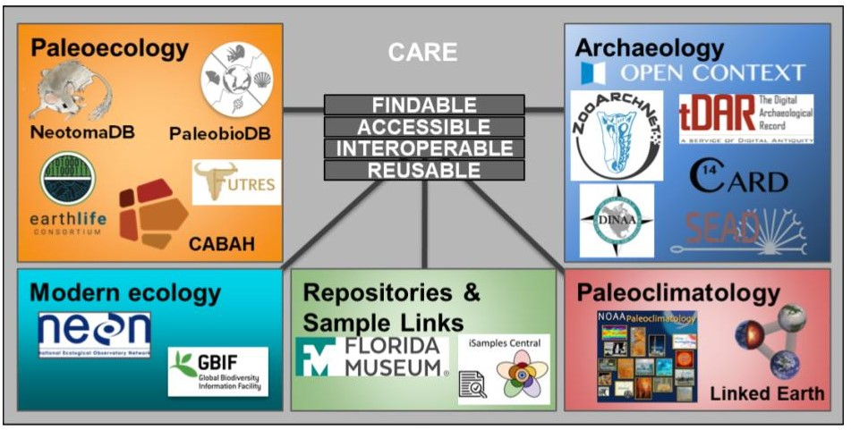

  

    

      <h1 style="font-size:40px;"> Aim 2: Enable FAIR Data Curation and Stewardship </h1>
      
Engaging Practitioners: Early Career Researchers, Disciplinary Scientists, and Data Managers

    

    

      <figure style="margin-left:0px;margin-right:0px;" id="stakes">
        
        <figcaption>This image is relevant to aim 2 </figcaption>
      </figure>
    

  

  

    <h2>Overview</h2>
    

      
Disciplinary practitioners and data managers must be trained in ethical open science practices in order to adopt them. As long-tail data disciplines, the Quaternary sciences have developed multiple mid-scale repositories containing large amounts of related but heterogeneously structured data. Thus, we must  approach data curation—and data curation training—from two perspectives. On the one hand, we must  work with disciplinary scientists to train them in best practices for collecting and publishing data in a way  that will best support dissemination and reuse; on the other hand, we must also work with the data  managers to design schema- and system-level best practices that facilitate data stewardship. There are thus two subcomponents within this section:
      <ol>
        <li>science-driven and FAIR/CARE-enabled research activities  led by early career researchers, with close support from data managers, and </li>
        <li>support for the adoption of FAIR-aligned technology within community-curated data repositories based on outcomes from the Mapping the Landscape work and gaps identified  by the science-driven research activities.</li>
      </ol>

      <h2>Activities</h2> 
        <button class="bttn" id="y2-web" onclick="Func_y2web()">
            

The <strong>Year 2 Webinar and Hackathon</strong>

</button>
        

          

          
Efforts to engage early career researchers working with data across community-curated data repositories will begin in Year 1 with the webinar and  symposium, with subsequent invitations to a set of early career reseachers to participate in the Year 2 webinar and symposium hackathon. The hackathon will be focused around science-driven use cases for community-curated data repository alignment. Early-career-researcher activities in the hackathon will be largely self-driven, with the identified project case studies scaffolding the hackathon activities. The community of more senior  data managers and disciplinary practitioners will support development of research aims during the hackathon itself. The hackathon will be preceded by a series of four webinars, introducing the early career researchers to the participating community-curated data repositories and to tools and approaches for data alignment. This will ensure that participants at the hackathon will have common knowledge of the available resources. All participants will also be exposed to basic principles of software development through the use of adapted education  modules, providing an opportunity to improve skills and to ensure all participants are able to engage fully in the workshop. Webinars following the hackathon will support ongoing work and serve to keep early career resarchers engaged after the symposium meeting, and will support the resolution of any ongoing difficulties as participants return to their home institutions. 

          

        

     
        <button class="bttn" id="os-casestudy" onclick="Func_oscasestudy()">
          

The <strong>‘Doing Open Science Across Disparate Data Types’ case study</strong>

      </button>
        

          

            
This case study will model reproducibility and open science for disciplinary practitioners (Aim 1), and serve to anchor  outreach to disciplinary practitioners through early-career-researcher activities (Aim 2). Quaternary and modern organismal  and environmental data can be linked by place and time, despite differing data types. For example, organismal occurrence data is typically georeferenced with a latitude and longitude, or at minimum locality information, as well as both date of collection and, for non-modern collections, temporal age of the  specimen. Workflows to combine organismal and environmental data (both paleo and modern) are already being created by many different data practitioners, but many are either not reproducible or not formalized into a published and shareable pipeline. By leveraging existing tools  to access and create interoperable data, and methods already commonly used by data practitioners to link data sources by spatial region and temporal span, we will create a model open science workflow aimed at data practitioners within the broader Quaternary science community. Developing this case study and workflow in Year 1 will highlight potential interoperability issues among Quaternary and modern data resources and feed into Aim 1 interoperability work. Using this  workflow, we can create a simple biology-motivated case study investigating macro-scale biodiversity change in relation to environmental and anthropogenic changes. The final workflow and case study will  then be packaged for disciplinary conference workshops and as an open educational resource aimed at undergraduate students to demonstrate the power of creating an interdisciplinary data resource ecosystem.

          

       

          <button class="bttn" id="pracs" onclick="Func_pracs()"> 
            

<strong>Community-Curated Data Repository guidance</strong> aimed at data contributors and <strong>workshops at disciplinary conferences</strong>

      </button>
          

            

              
Given the complexity of data resources within our disciplinary communities, a key need is guidance aimed at data generators on the set of options for data curation within different disciplinary communities. Early career researchers  will also likely be engaged in data curation activities, and one outcome of the early-career-researcher activities will be best practices documentation to support onboarding data, such as 
                <ul>
                  <li>a resource describing the scope of data repositories amongst the community</li> 
                  <li>goals and aims of different community-curated data repositories</li>
                    <li>types of data and formats accepted by community-curated data repositories, and </li> 
                  <li>checklists to facilitate ease of use</li>.
              </ul>

Much of the work of furthering the adoption of FAIR and CARE principles in disciplinary communities comes not just through technical advances but through establishing a culture of openness, literacy, and trust in FAIR and CARE principles. In order to disseminate the RCN documentation and guidance and thus help support ethical FAIROS data curation practices amongst the broader community, we will lead and facilitate training and outreach workshops at professional society meetings. To do this, we will convert the various best practices documentation into training videos and other  introductory resources aimed at the core disciplinary practitioner communities. 

            

      

      <button class="bttn" id="year3" onclick="Func_year3()"> 
          

The <strong>Year 3 Webinar and Hackathon</strong>, and guidance on <strong>data stewardship best practices</strong>

      </button>
      

          

            
Interoperability and reproducibility are only part of the FAIROS puzzle. Repositories require trust and practitioners require skills to support sustainable FAIROS practices. The  focus in Year 3 is on solidifying the adoption of better data science and curation practices to support  FAIROS practices in the future, and to preserve the critical role that small- and mid-scale data resources provide in the information architecture of the sciences. Support of best practices adoption will be undertaken  through continued engagement with early career researchers, while re-engaging members within the Informatics  domain to address technical gaps identified through the Years 1 and 2 hackathon efforts. Year 3 activities  will also focus on software practices that can support trust in online data repositories, including OAuth systems, data versioning, JSON-LD serialization, APIs, and other technical architecture that is required to  properly support FAIROS practices. As with previous years, there will be a series of webinars prior to the Year 3 symposium hackathon; the hackathon will focus on implementation of software practices within community-curated data repositories, and follow-up webinars will focus on developing and refining best-practices documentation for  implementing these applications and tools within Quaternary community-curated data repositories.

          

      

    

  

