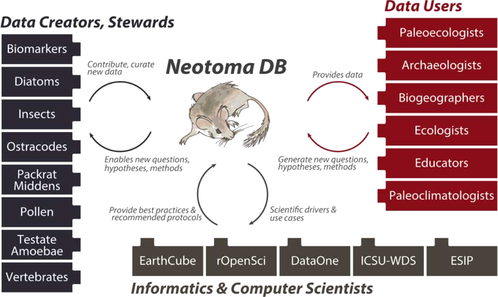

  

    

      <h1 id="title" style="font-size:calc(20px + 3vw);"> Aim 2: Enable FAIR Data Curation and Stewardship </h1>
      
Engaging Early Career Researchers, Disciplinary Scientists, and Data Managers

    

    <!-- 

      <figure style="margin-left:0px;margin-right:0px;max-width:500px;" id="neo">
        
        <figcaption id="cap">Neotoma draws together a community of data managers and disciplinary practitioners working in Quaternary science. Williams, Grimm, Blois et al, 2018: The Neotoma Paleoecology Database, a multiproxy international, community-curated data resource. <i>Quaternary Research.</i></figcaption>
      </figure>
    
 -->
  

  

    

    <h2>Overview</h2>
    

      
The Quaternary sciences have developed multiple mid-scale repositories containing large amounts of related but heterogeneously structured data. We must approach curation of this data from two perspectives. On the one hand, we must work with disciplinary scientists to train them in best practices for collecting and publishing data to support dissemination and reuse; on the other hand, we must also work with the data  managers to design best practices that facilitate data stewardship.

      <h2>Activities</h2> 
        <button class="bttn" id="y2-web" onclick="Func_y2web()">
            

<strong>The Year 2 Webinar and Hackathon</strong>

</button>
        

          

          
The Year 2 hackathon will be focused around science-driven use cases for community-curated data repository alignment and will be preceded by a series of four webinars, introducing early career researchers to the participating community-curated data repositories and to tools and approaches for data alignment. All participants will also be exposed to basic principles of software development through the use of adapted education modules, providing an opportunity to improve skills and to ensure all participants are able to engage fully in the workshop. Webinars following the hackathon will enable ongoing work, keep early career researchers engaged after the symposium, and support the resolution of any ongoing difficulties as participants return to their home institutions. 

          

        

     
        <button class="bttn" id="os-casestudy" onclick="Func_oscasestudy()">
          

<strong>Doing Open Science Across Disparate Data Types</strong>

      </button>
        

          

            
 Quaternary and modern organismal  and environmental data can be linked by place and time, despite differing data types. For example, organismal occurrence data is typically georeferenced with a latitude and longitude, as well as both date of collection and, for non-modern collections, temporal age of the  specimen. Workflows to combine organismal and environmental data (both paleo and modern) are already being created by many different data practitioners, but many are either not reproducible or not formalized into a published and shareable pipeline. By leveraging existing tools  to access and create interoperable data, and methods already commonly used by data practitioners to link data sources by spatial region and temporal span, we will create a model open science workflow aimed at data practitioners within the broader Quaternary science community. Developing this case study and workflow will highlight potential interoperability issues among Quaternary and modern data resources and feed into Aim 1 interoperability work. Using this workflow, we can create a simple biology-motivated case study investigating macro-scale biodiversity change in relation to environmental and anthropogenic changes. 

          

       

          <button class="bttn" id="pracs" onclick="Func_pracs()"> 
            

<strong>Guidance for Practitioners</strong>

      </button>
          

            

              
Given the complexity of data resources within our disciplinary communities, a key need is guidance aimed at data generators on the set of options for data curation within different disciplinary communities. Early career researchers will also be engaged in data curation, and one outcome of their activities will be documentation of best practices to support the onboarding of data. This documentation may include
                <ul>
                  <li>a resource describing the scope of data repositories amongst the community,</li> 
                  <li>goals and aims of different community-curated data repositories,</li>
                    <li>types of data and formats accepted by community-curated data repositories, and </li> 
                  <li>checklists to facilitate ease of use.</li>
              </ul>

The adoption of ethical open science principles depends not just on technical advances but also on establishing a culture of openness, literacy, and trust in FAIR and CARE principles. In order to disseminate ethical and open curatorial practices amongst the broader community, we will lead and facilitate training and outreach workshops at professional society meetings. To do this, we will convert the various best practices documentation into training videos and other introductory resources aimed at the core disciplinary practitioner communities. 

            

      

      <button class="bttn" id="year3" onclick="Func_year3()"> 
          

The <strong>Year 3 Webinar and Hackathon</strong> and guidance on <strong>data stewardship best practices</strong>

      </button>
      

          

            
Interoperability and reproducibility are only part of the open science puzzle. Repositories require trust and practitioners require skills to implement sustainable ethical open science practices. The focus in Year 3 is on solidifying the adoption of better data science and curation practices to support ethical open science in the future, and to preserve the critical role that small- and mid-scale data resources provide in the information architecture of the sciences. We will support the adoption of best practices through continued engagement with early career researchers, while re-engaging members within the Informatics  domain to address technical gaps identified through the Years 1 and 2 hackathon efforts. Year 3 activities  will also focus on software practices that can support trust in online data repositories, including OAuth systems, data versioning, JSON-LD serialization, APIs, and other technical architecture that is required to  properly support ethical open science. The hackathon will focus on implementation of software practices within community-curated data repositories, and follow-up webinars will focus on developing and refining documentation of best practices for  implementing these applications and tools within Quaternary community-curated data repositories.

          

      

    

    

  <!-- 

        <figure style="margin-right:0px;min-width:220px;" id="fair-des">
        
        <figcaption style="text-align:center;"></figcaption>
        </figure>
    
 -->
  

