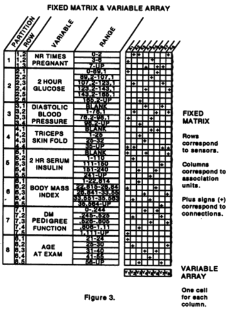
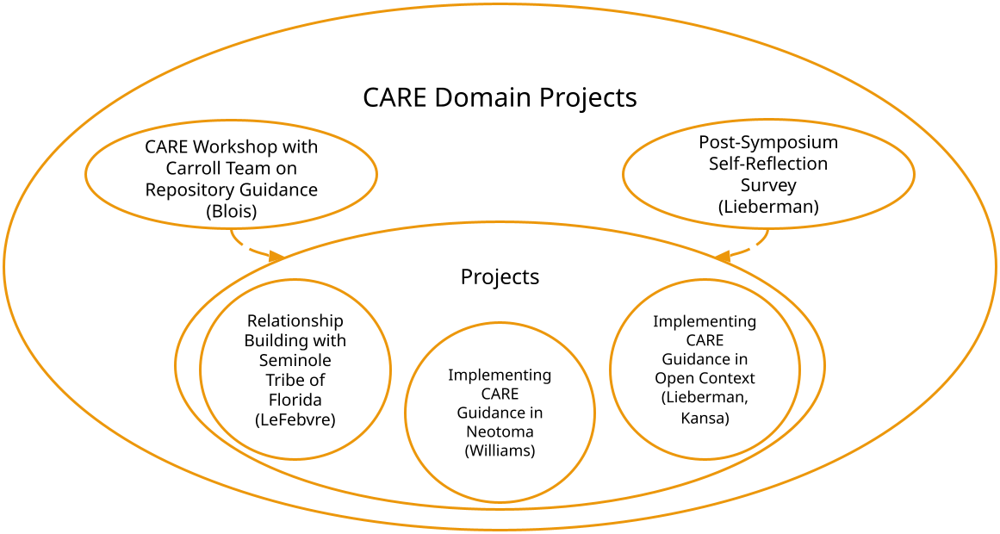

  

    

      <h1 style="font-size:calc(20px + 3vw);"> Aim 3: Support Equity and Improve Access </h1>
      
 Ethical Open Data Science: Moving from CARE Principles to Practice 

    

   <!-- 

      <figure style="margin-left:0px;margin-right:0px;max-width:305px;" id="pima">
        
        <figcaption id="cap">The 'Pima Indians Diabetes Data Set' is regularly used to train machine learning models, without the authorization of and without benefit to the Akimel O'odham community from which the data derives. Radin, 2017: 'Digital Natives': How Medical and Indigenous Histories Matter for Big Data. <i>Osiris.</i></figcaption>
      </figure>
    
 -->
  

  

    

    <h2>Overview</h2>
    

      
We will advance the implementation of CARE best practices at all stages of the research data life cycle.

      <h2>Activities</h2>
        <button class="bttn" id="synth" onclick="Func_synth()">
          

<strong>Implementing CARE practices in Databases</strong>

</button>
        

          

          
We will focus on two well-established open community data resources—Open Context and Neotoma—as  test cases for exploring how best to implement CARE practices in archaeological and paleoecological  datasets. CARE introduces a set of important technical requirements that need to be supported. For  example, data infrastructure needs to support Traditional Knowledge labels and notifications to help better express cultural aspects of data provenance and expectations for benefits sharing. Similarly, data infrastructure needs to be flexible enough to manage culturally specific systems of metadata documentation. These expanded and diversified sets of metadata needs will also need to be managed by curation workflows that inclusively represent stakeholder interests.

            

The exact form of implementation will vary among open data resources, and it is unlikely that a single solution will work for all. Hence, over the course of the symposia hackathons, webinars, and other activities, we will use Open Context and Neotoma as two representative instances of open community data resources in archaeology and paleoecology, with differing degrees of implementation of CARE principles and pre-existing relationships with Indigenous leaders and scholars. Symposia breakout sessions and hackathon  activities will help identify technical requirements to guide CARE principle-aligned improvements to Open Context and Neotoma, which can then serve as model examples for other data resources. 
 

          

        

       
        <button class="bttn" id="symp" onclick="Func_symp()">
          

<strong>Annual plenary symposia</strong>

      </button>
        

          

            
All symposia will include activities specifically devoted to advancing FAIR and CARE principles, in order to  help set desired professional norms and provide examples of how CARE implementation can be advanced.  Symposia activities will emphasize the importance of CARE data principles at each stage of the research data lifecycle, from initial conceptualization of a project, to data collection and analysis, interpretation and  communication of results, and finally the long term curation and reuse of research data. In the early years  of our RCN activities, we will invite keynote speakers from Research Data Alliance, the Centre for Australian Biodiversity and Heritage (CABAH), and other organizations to provide model examples of advancing CARE, with breakout discussions on how to best advance CARE among participating open-data resources  and their networks of allied practitioners. In later years, we will review and discuss current efforts to begin  implementing CARE best practices in participating data resources.

          

       

       
          <button class="bttn" id="profs" onclick="Func_profs()"> 
            

<strong>Professional development workshops</strong>

      </button>
          

            

              
In addition to the annual symposia, we plan to lead multiple, virtual, synchronous workshops that are devoted to the professional development of informaticists and early career researchers who are interested in learning about CARE and how best to translate principles to action. These workshops will be attended by RCN members as well as through open calls to the communities of paleo- and modern ecologists, environmental archaeologists, and paleoclimatologists, with early career researchers and members of descendant communities in particular encouraged to apply. Participants will be encouraged to do some reading and preparation in advance of each workshop, which will consist of short lectures and learning activities that contribute to the development of individual action plans for participants.

While early career researchers tend to think that working with data is important for them and their future careers, many believe that they lack both the comfort and training, especially around ethical practices, to do so. These workshops aim to provide this kind of training specifically for individuals who do not have access to similar resources through their own institutions. In this way, we will be able to expand knowledge around applying CARE to underserved communities, providing mentorship and support so that participants can develop skills that are critically important for their success. Moreover, we aim to publish our curriculum open access so that others can adopt and adapt it for other contexts and audiences, exponentially increasing the number of people this work reaches. 

            

      

      

    

   <!-- 

        <figure style="margin-right:0px;min-width:300px;" id="care-des">
        
        <figcaption style="text-align:center;"></figcaption>
        </figure>
    
 -->
  

