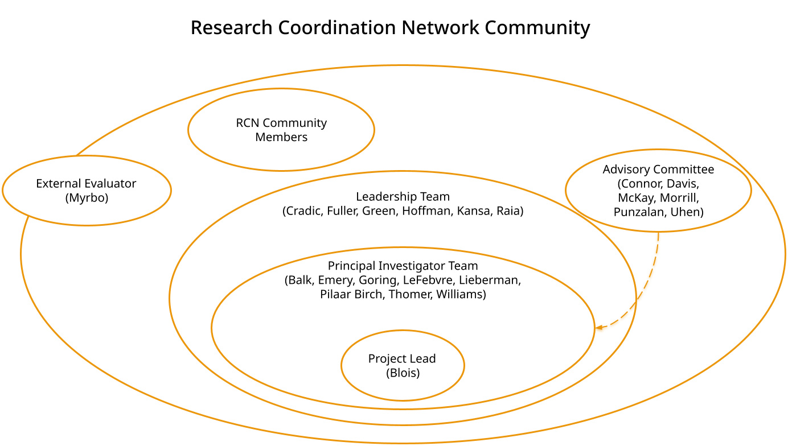
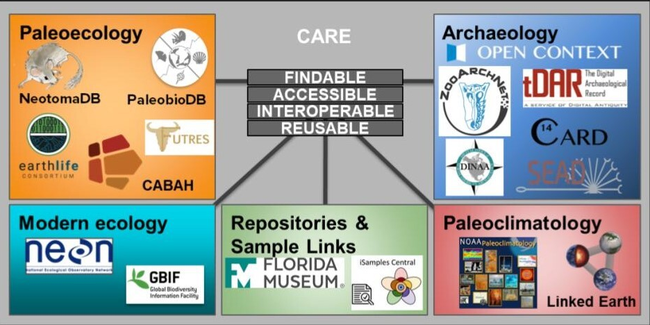

    

      <h1 style="font-size:calc(20px + 3vw);align-self:start;">Meet our Team</h1>
      
Our team of principal investigators, advisors, personnel, and other RCN members is committed to building a just, open scientific community.

    

    

      <figure id="stakes">
        
        <figcaption></figcaption>
      </figure>
    

  

  

  <h2 style="color:#42b7bf;margin-bottom:0px; background-color:#fff;z- index:9;position:relative;overflow:visible; border-bottom:1px solid #ec970b;width:100%">The Principal Investigators</h2>
  

  

  
    
        

          

            
{{ team_member.name }}

            
{{ team_member.role }}

            
{{ team_member.institution }} 

          

          
          

            
          

        

     
  

 
  

   <h2 style="color:#42b7bf;margin-bottom:0px; background-color:#fff;z-index:9;position:relative;overflow:visible; border-bottom:1px solid #ec970b;width:100%;">The Advisory Committee</h2>
  

  

  
      
        

          

            
{{ advise_member.name }}

            
{{ advise_member.institution }}

          

          
          

            
          

          
        

       
  

 
   

  <h2 style="color:#42b7bf;margin-bottom:0px; background-color:#fff;z- index:9;position:relative;overflow:visible; border-bottom:1px solid #ec970b;width:100%">Personnel</h2>
  

  

  
    
        

          

            
{{ team_member.name }}

            
{{ team_member.role }}

            
{{ team_member.institution }} 

          

          
          

            
          

        

     
  

  

  <h2 style="color:#42b7bf;margin-bottom:0px; background-color:#fff;z- index:9;position:relative;overflow:visible; border-bottom:1px solid #ec970b;width:100%">Related Repositories</h2>
  

  

   
  

  
  
 
