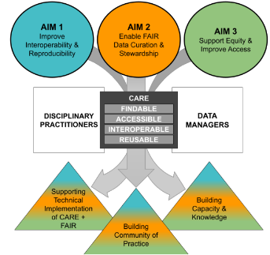
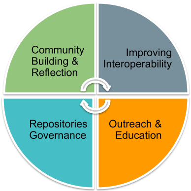

  

    

      <h1 style="font-size:calc(20px + 3vw);align-self:start;">Our Work</h1>
      
Building an open and just scientific community

    

    

      <figure id="stakes">
        
       <!-- <figcaption>The sets of lead and affiliated data resources involved in this RCN. </figcaption> -->
      </figure>
    

  

  
 We aim to improve data infrastructure for the Quaternary scientific community.
 
  
We will modify our repositories of fossil specimen data to make their holdings more <strong>accessible</strong>. We will make these repositories more <strong>equitable</strong> as well, especially for the Indigenous nations from whose lands the fossils have been excavated. We will train those who manage these data and those who use them for research purposes in <strong>best practices</strong> to maintain access and equity into the future. 

  
  

    

      

        <h3 style="border-bottom: 1px solid #ec970b;"> <a href="https://hoffmanick.github.io/fairos/aim1" style="font-size:1.4em">Aim 1:</a> Improve Interoperability and Reproducibility </h3>
        
 We will develop guidance for interoperability among community-curated data resources and
        promote adoption of broader metadata standards. 

      

      

        <h3 style="border-bottom: 1px solid #ec970b;"> <a href="https://hoffmanick.github.io/fairos/aim2" style="font-size:1.4em">Aim 2:</a> Enable FAIR Data Curation and Stewardship </h3>
        
  We will promote better data science and curation practices among disciplinary practitioners, with a particular focus on early-career disciplinary researchers and develop and promote best practices and standards for data stewardship. 

      

      

        <h3 style="border-bottom: 1px solid #ec970b;"> <a href="https://hoffmanick.github.io/fairos/aim3" style="font-size:1.4em">Aim 3:</a> Support Equity and Improve Access </h3>
        
 We will democratize science in a manner that recognizes broader concepts of data ownership and ethical data curation. 

      

    

    

  

  

    <h4>Annual Symposia</h4>
    
We are meeting yearly in person to think together about implementing ethical open science in our data ecosystems, furthering all our aims.

    <h4>Ethical Open Science Self-Reflection Survey</h4>
    
Our self-reflection survey on our personal and institutional relationships to FAIR, CARE, and EOS have been guiding our subsequent actions.

    <h4>Webinar Series</h4>
    
We provide a forum for experts in informatics and ethics to share their work with us.

    <h4>Reading Group</h4>
    
We meet monthly to discuss selections from the literature on the political economy of data.

  

  
  

    

    <h4>Mapping the Interoperability Landscape</h4>
      
We are interviewing data managers and disciplinary practitioners to map the ways they interoperate data, suprporting aims 1 and 3.

    <h4>Case Study: Linking data across repositories</h4>
      
Using our focal repositories as a case study, we are developing a workflow to enhance data linkages, furthering all our aims.

    <h4>Neotoma constituent database landing pages</h4>
      
These pages offer greater transparency for users of Neotoma's data, a facet of aims 2 and 3.

  

  
  

  
  

   

   
  

  
  

    

    <h4>Case studies: Neotoma, Open Context, Florida Museum</h4>
      
We are using our focal repositories as case studies for improving data governance and bolstering our commitment to Indigenous data sovereignty.

  

  
  

      

    <h4>ECR Projects: Doing Ethical Open Science Across Disparate Data Types</h4>
        
We are working with early career researchers to.... ? 

        <h4>FAIR/CARE educational materials</h4>
        
We are producing material for undergraduates studying data science and ecology to introduce them to principles of ethical open data management.

        <h4>Data repository decision tree</h4>
        
We are supporting early career researchers by providing them with a resource to guide their choice of repository for data or specimen upload.

  

  

