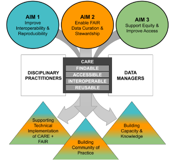

  

    

      <h1 style="font-size:40px;">Research</h1>
      
We are pursuing three research aims.

    

    

      <figure>
        
        <figcaption>The sets of lead and affiliated data resources involved in this RCN. </figcaption>
      </figure>
    

  

  
  

    

      <h2>Project Aims</h2>
       

        <figure>
          
          <figcaption>The central aims, people, and outcomes that motivate this RCN. </figcaption>
        </figure>
       

    

    

      

        <h3> Aim 1: Improve Interoperability and Reproducibility </h3>
        
 We will a) develop guidance for interoperability among long-tail community-curated data resources and
        b) promote adoption of broader metadata standards. 

      

      

        <h3> Aim 2: Enable FAIR Data Curation and Stewardship </h3>
        
  We will a) promote better data science and curation practices among disciplinary practitioners, with a particular focus on    early-career disciplinary         researchers and b) develop and promote best practices and standards for data stewardship. 

      

      

        <h3> Aim 3: Support Equity and Improve Access </h3>
        
 We will democratize science in a manner that recognizes broader concepts of data ownership and ethical data curation. 

      

    

