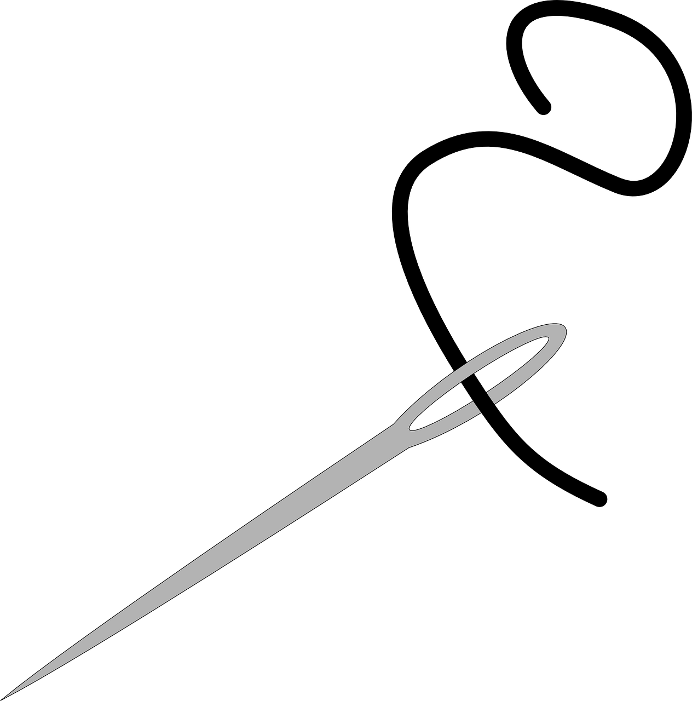

    

      <h1 style="font-size:calc(20px + 3vw);height:40px;align-self:start;">Resources</h1>
      
Get connected to the tools that will enable you to implement ethical open science principles in your own work.

    

   <!-- 

      <figure id="stakes">
        
      </figure>
    
 -->
  

  

    

      <h2> Educational Materials </h2>
      
 Check back here soon for our educational material. 

    

    

      <h2> Further Readings </h2>
      
Take a look at our <a href="https://www.zotero.org/groups/5074488/global_change_fairos/library">bibliography</a> of scholarship on building just and open data infrastructure.

    

