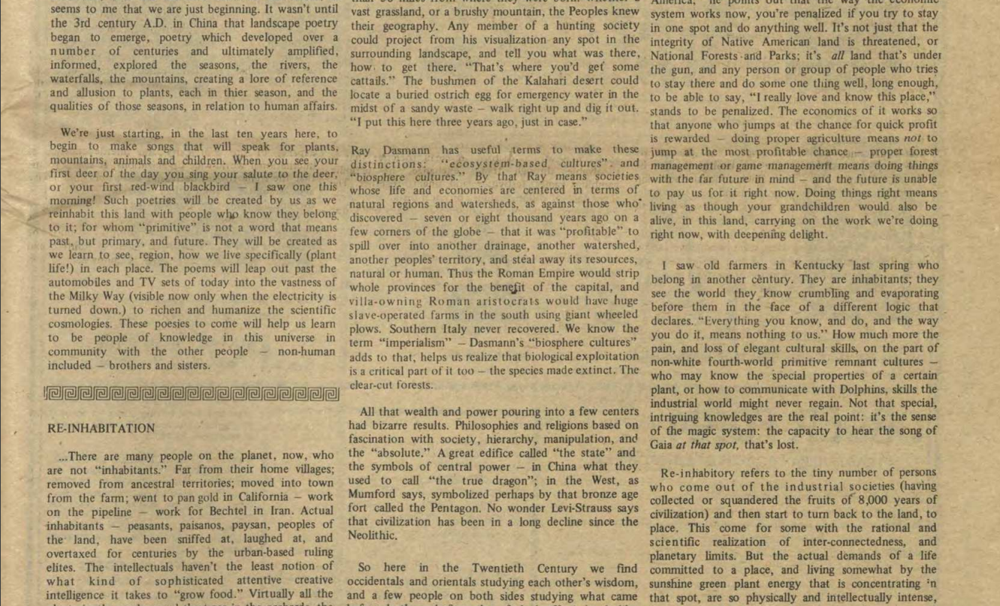

   

      <h1 style="align-self:start;font-size:calc(20px + 3vw);">Webinars</h1>
    <!--  
Learn about what we've been up to, and watch out for upcoming events.
 -->
    

  <!--  

      <figure id="notes">
        
        <figcaption id="cap">Excerpt from a book review written by Gary Snyder in the Spring 1978 issue of Akwesasne Notes. Akwesasne Notes, “Akwesasne Notes vol. 10 no. 1,” 
          American Indian Digital History Project, accessed June 12, 2023, http://www.aidhp.com/items/show/48.</figcaption>
      </figure>
    
 -->
  

   

     
      
      

           
            
          
          
            

              <!-- 
empty
 -->
            

          
        

        
{{ post.date | date_to_string }}

        
<a href="{{ post.url | relative_url }}">{{ post.title }}</a>

         

      



    

